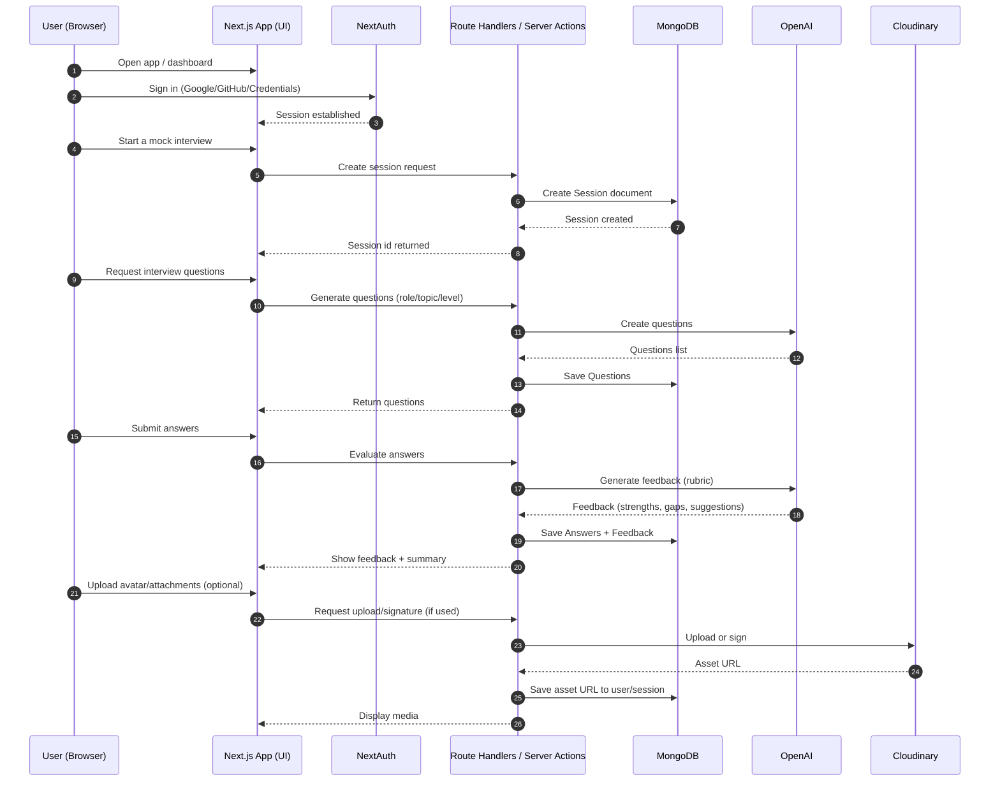

# PrepPilot — Interview Preparation AI


-000?logo=auth0&logoColor=white>)


An interview preparation web app that helps users practice with AI-generated questions, receive structured feedback, and track progress over time.

---

## Table of Contents

- [Demo](#demo)
- [Screenshots](#screenshots)
- [Tech Stack](#tech-stack)
- [Features](#features)
- [Getting Started](#getting-started)
- [Environment Variables](#environment-variables)
- [Project Structure](#project-structure)
- [How It Works](#how-it-works)
- [Authentication](#authentication)
- [AI & Prompting](#ai--prompting)
- [Media Uploads (Cloudinary)](#media-uploads-cloudinary)
- [Deployment](#deployment)
- [Future Improvements](#future-improvements)
- [Contributing](#contributing)
- [License](#license)

---

## Demo

- Live Demo: https://YOUR-DEPLOYMENT-URL.vercel.app
- Video Demo (optional): https://YOUR-DEMO-VIDEO-LINK

> Click the image below to watch the demo video

[](https://YOUR-DEMO-VIDEO-LINK)

[↑ Back to Top](#top)

---

## Screenshots

|                   **Dashboard**                   |                **Mock Interview**                 |
| :-----------------------------------------------: | :-----------------------------------------------: |
|  |  |

|                  **AI Feedback**                   |                  **Profile**                  |
| :------------------------------------------------: | :-------------------------------------------: |
|  |  |

[↑ Back to Top](#top)

---

## Tech Stack

- **Framework**: Next.js (TypeScript) + React
- **UI**: Tailwind CSS + HeroUI + Iconify
- **Auth**: NextAuth (Auth.js)
- **Database**: MongoDB
- **AI**: OpenAI API (server-side)
- **Media Storage**: Cloudinary
- **Deployment**: Vercel

[↑ Back to Top](#top)

---

## Features

- **AI Interview Practice**: generate questions by role/seniority/topic
- **Mock Interview Sessions**: session-based practice + history
- **Structured Feedback**: strengths, weaknesses, improvements, sample answer hints
- **Question Bank**: save, tag, favorite, search questions
- **User Profiles**: progress tracking, streaks (optional)
- **Secure Authentication**: NextAuth (email/OAuth provider)
- **Image Uploads**: Cloudinary integration for avatars (or attachments)

[↑ Back to Top](#top)

---

## Getting Started

### Prerequisites

- Node.js **18+**
- npm / pnpm / yarn
- MongoDB (Atlas recommended)
- Cloudinary account
- OpenAI API key

### Installation

```bash
git clone https://github.com/YOUR_USERNAME/YOUR_REPO.git
cd YOUR_REPO
npm install
npm run dev

Open http://localhost:3000
```

[↑ Back to Top](#top)

---

## Environment Variables

<details>
<summary>Click to expand the environment variables</summary>

Create a `.env.local` file in the project root.
**Do not commit** `.env.local` to GitHub.

### 1) Required Variables

| Variable                | Example                                | Description                                                                |
| ----------------------- | -------------------------------------- | -------------------------------------------------------------------------- |
| `MONGODB_URI_LOCAL`     | `mongodb://localhost:27017/prep-pilot` | MongoDB connection string (Atlas recommended).                             |
| `MONGODB_URI`           | `mongodb://localhost:27017/prep-pilot` | MongoDB connection string (Atlas recommended).                             |
| `NEXTAUTH_URL`          | `http://localhost:3000`                | Base URL used by NextAuth callbacks. Use your Vercel domain in production. |
| `NEXTAUTH_SECRET`       | `your-long-random-secret`              | Secret for signing/encrypting NextAuth cookies/JWT.                        |
| `OPENAI_API_KEY`        | `sk-...`                               | OpenAI API key (server-side only).                                         |
| `CLOUDINARY_CLOUD_NAME` | `your_cloud_name`                      | Cloudinary cloud name.                                                     |
| `CLOUDINARY_API_KEY`    | `1234567890`                           | Cloudinary API key (server-side).                                          |
| `CLOUDINARY_API_SECRET` | `your_api_secret`                      | Cloudinary API secret (server-side).                                       |

---

### 2) Optional Variables (Auth Providers)

> Only add these if you enabled the provider in your NextAuth config.

| Variable               | Example                         | Description                 |
| ---------------------- | ------------------------------- | --------------------------- |
| `GOOGLE_CLIENT_ID`     | `...apps.googleusercontent.com` | Google OAuth client ID.     |
| `GOOGLE_CLIENT_SECRET` | `...`                           | Google OAuth client secret. |
| `GITHUB_CLIENT_ID`     | `...`                           | GitHub OAuth client ID.     |
| `GITHUB_CLIENT_SECRET` | `...`                           | GitHub OAuth client secret. |

---

### 3) Optional Variables (Cloudinary Upload Preset / Folder)

Use these if you configured unsigned uploads or want consistent organization.

| Variable                   | Example                | Description                                     |
| -------------------------- | ---------------------- | ----------------------------------------------- |
| `CLOUDINARY_UPLOAD_FOLDER` | `preppilot/avatars`    | Default folder for uploads.                     |
| `CLOUDINARY_UPLOAD_PRESET` | `unsigned_preset_name` | Upload preset name (if using unsigned uploads). |

</details>

[↑ Back to Top](#top)

---

## Project Structure

<details>
<summary>Click to view the project structure with diagram</summary>

This repository follows a feature-oriented Next.js structure with a clear separation between:

- **UI routes & pages** (`app/`)
- **Reusable UI components** (`components/`)
- **Backend logic / services** (`backend/`)
- **Shared configuration & constants** (`config/`, `constants/`)
- **Static assets** (`public/`)

### Folder Tree (high-level)

```txt
prep-pilot/
├─ app/                # Next.js App Router (routes, layouts, API routes)
├─ backend/            # Server-side logic (OpenAI, DB access, helpers)
├─ components/         # Reusable UI components (HeroUI wrappers, shared UI)
├─ config/             # App configuration (auth, db, cloudinary, etc.)
├─ constants/          # App constants (roles, prompts, limits, routes, etc.)
├─ public/             # Static assets
├─ actions/            # Project actions/automation scripts (if used)
├─ middleware.ts       # Next.js middleware (route protection, redirects)
├─ next.config.ts
├─ tailwind.config.ts
├─ postcss.config.mjs
├─ eslint.config.mjs
├─ tsconfig.json
└─ package.json
```

Note: the **app/** folder is the “routing layer” (pages, layouts, API routes).
The **backend/** folder is the “service layer” (OpenAI, MongoDB, Cloudinary logic, etc.).

### Project Diagram (Mermaid)

```mermaid
flowchart TB
  Repo[Prep Pilot Repo]

  Repo --> App[app]
  Repo --> Backend[backend]
  Repo --> Components[components]
  Repo --> Config[config]
  Repo --> Constants[constants]
  Repo --> Public[public]
  Repo --> Actions[actions]

  Repo --> Middleware[middleware.ts]
  Repo --> NextConfig[next.config.ts]
  Repo --> TailwindConfig[tailwind.config.ts]
  Repo --> PackageJson[package.json]

  App --> AppPages[Pages and Layouts]
  App --> AppApi[API Route Handlers]

  Components --> UI[UI Components]
  Components --> Shared[Shared Components]
  Components --> Features[Feature Components]

  Backend --> DB[MongoDB Access]
  Backend --> AI[OpenAI Service]
  Backend --> Media[Cloudinary Service]
  Backend --> Utils[Utilities and Validation]

  Config --> AuthCfg[NextAuth Config]
  Config --> DbCfg[DB Config]
  Config --> CloudCfg[Cloudinary Config]

  Constants --> Prompts[Prompt Templates]
  Constants --> Enums[Enums and Limits]

```



</details>

[↑ Back to Top](#top)

---

## How It Works

<details>
<summary>Click to view the project workflow and understand the end-to-end process. </summary>

Prep Pilot is a Next.js interview practice app using NextAuth (Google/GitHub/Credentials), MongoDB, OpenAI, and Cloudinary.

### 1) Sign in (NextAuth)

- User signs in using **Google / GitHub / Credentials**
- NextAuth creates a session and the app can access the user on protected pages

### 2) Start a Mock Interview (Create Session)

- User selects role/topic/level
- Server creates a **Session** in **MongoDB**
- Session id is returned to the client to continue the interview flow

### 3) Generate Questions (OpenAI)

- Client requests questions for the current session (role/topic/level)
- Server calls **OpenAI** (server-side only)
- Generated questions are returned to the UI and saved to **MongoDB** for history/review

### 4) Submit Answers → Get Feedback (OpenAI)

- User submits answers
- Server sends answers + rubric/prompt to **OpenAI**
- OpenAI returns structured feedback (strengths, weaknesses, suggestions)
- Answers + feedback are saved to **MongoDB** and shown on the UI

### 5) Upload Media (Cloudinary)

- For avatars or attachments, the app uploads files to **Cloudinary**
- Cloudinary returns an asset URL
- The app stores the URL in **MongoDB** and displays it in the UI

### Data Stored (Conceptual)

- **User**: auth provider ids, profile info, avatar URL
- **Session**: userId, role/topic/level, timestamps, summary/score (optional)
- **Question**: sessionId, content, tags/difficulty (optional)
- **Answer**: questionId, user response, timestamps
- **Feedback**: answerId, rubric scores, suggestions
- **Asset**: userId/sessionId, cloudinary URL, type (optional)

### High-level Flow



</details>

[↑ Back to Top](#top)

---

## Authentication

<details>
<summary>Click to view the authentication flow — from sign in to secured access.</summary>

Prep Pilot uses **NextAuth** to support multiple sign-in methods:

- **Google OAuth**
- **GitHub OAuth**
- **Credentials** (email + password)

### How authentication works

1. The user signs in via Google/GitHub or enters credentials.
2. NextAuth creates a secure session (cookie/JWT depending on your config).
3. Protected pages and API routes verify the session before returning data.

### Auth routes

- NextAuth handler: `app/api/auth/[...nextauth]/route.ts`

### Protected routes

- Route protection can be handled via:
  - `middleware.ts` (redirect unauthenticated users)
  - server checks (e.g., `getServerSession()` in server components / route handlers)

### Required environment variables

```bash
NEXTAUTH_URL=http://localhost:3000
NEXTAUTH_SECRET=your_long_random_secret

GOOGLE_CLIENT_ID=...
GOOGLE_CLIENT_SECRET=...

GITHUB_CLIENT_ID=...
GITHUB_CLIENT_SECRET=...
```

</details>

[↑ Back to Top](#top)

---

## AI & Prompting

<details>
<summary>Click to expand and see how AI is used to generate mock interviews and analyze your answers.</summary>

Prep Pilot uses the OpenAI API to power two core experiences:

1. **Custom mock interview generation** (personalized question sets)
2. **Answer evaluation** (scores + actionable feedback)

### 1) Custom Mock Interview Generation

Users can build a mock interview by selecting:

- **Industry** (e.g., tech, finance, healthcare)
- **Topic** (e.g., JavaScript, data analysis)
- **Type** (technical / behavioral)
- **Job Role** (e.g., software engineer, project manager)
- **Experience Level** (entry / mid / senior)
- **Duration** (15–60 minutes)
- **Number of Questions**

The server converts these inputs into a prompt and requests a structured list of interview questions that match the selected scenario. The generated questions are saved to MongoDB so users can review them later.

### 2) AI Results Analysis (Scores + Feedback)

After the user submits answers, Prep Pilot sends the interview context + responses to OpenAI and generates:

- **Overall Score**
- **Clarity Score**
- **Relevance Score**
- **Correctness Score**
- **Personalized Feedback**
  - What the user did well
  - What needs improvement
  - Actionable suggestions for better answers

Results are stored in MongoDB and shown on the dashboard for tracking progress over time.

### Prompt Design Principles

- **Server-side only**: OpenAI requests run on the server to protect API keys.
- **Structured outputs**: prompts request predictable formatting (scores + feedback sections) so the UI can render reliably.
- **Context-aware**: prompts include industry/topic/type/role/level so questions and feedback stay relevant.

### Subscription Gating (Stripe)

AI features can be gated behind a **Stripe monthly subscription**:

- Free users may have limited interview generations or limited analyses.
- Subscribed users unlock full mock interview creation and detailed AI analysis.
- Billing and invoices are handled through Stripe and exposed in the user dashboard.

### Notes

- Keep prompt templates versioned so changes do not break the UI.
- Validate AI responses before saving/rendering (recommended: schema validation).
</details>

[↑ Back to Top](#top)

---

## Media Uploads (Cloudinary)

<details>
<summary>Click to view how Media Uploads (Cloudinary) setup</summary>

Prep Pilot uses **Cloudinary** to handle media uploads such as user avatars and optional interview-related attachments.

### Upload flow

1. User selects an image/file in the UI.
2. The app uploads the file to **Cloudinary** (server-side upload or client upload depending on implementation).
3. Cloudinary returns a secure URL.
4. The URL is saved in **MongoDB** and used to display the media in the app.

### Required environment variables

```bash
# Option A (recommended)
CLOUDINARY_URL=cloudinary://<api_key>:<api_secret>@<cloud_name>

# Option B (separated)
CLOUDINARY_CLOUD_NAME=
CLOUDINARY_API_KEY=
CLOUDINARY_API_SECRET=
```

</details>

[↑ Back to Top](#top)

---

## Deployment (Vercel)

<details>
<summary>Click to view how Prep Pilot was deployed on Vercel.</summary>

Prep Pilot is deployed on **Vercel**.

### 1) Deploy to Vercel

1. Push the project to GitHub.
2. Go to Vercel → **New Project** → Import `prep-pilot`.
3. In **Project Settings → Environment Variables**, add all required variables:

   - `MONGODB_URI`
   - `NEXTAUTH_URL`
   - `NEXTAUTH_SECRET`
   - `GOOGLE_CLIENT_ID`, `GOOGLE_CLIENT_SECRET`
   - `GITHUB_CLIENT_ID`, `GITHUB_CLIENT_SECRET`
   - `OPENAI_API_KEY`
   - Cloudinary variables (`CLOUDINARY_URL` or `CLOUDINARY_CLOUD_NAME` + `CLOUDINARY_API_KEY` + `CLOUDINARY_API_SECRET`)
   - Stripe variables (if enabled): `STRIPE_SECRET_KEY`, `STRIPE_WEBHOOK_SECRET`, `NEXT_PUBLIC_STRIPE_PUBLISHABLE_KEY`, `STRIPE_PRICE_ID`

4. Click **Deploy**.

### 2) Configure OAuth Callback URLs (Google / GitHub)

#### Google OAuth

In Google Cloud Console → OAuth Client:

- **Authorized JavaScript origins**:
  - `http://localhost:3000`
  - `https://YOUR_VERCEL_DOMAIN`
- **Authorized redirect URIs**:
  - `http://localhost:3000/api/auth/callback/google`
  - `https://YOUR_VERCEL_DOMAIN/api/auth/callback/google`

#### GitHub OAuth

In GitHub Developer Settings → OAuth App:

- **Homepage URL**:
  - `https://YOUR_VERCEL_DOMAIN`
- **Authorization callback URL**:
  - `https://YOUR_VERCEL_DOMAIN/api/auth/callback/github`

### 3) Stripe Webhook (if subscriptions are enabled)

1. Create a webhook endpoint in Stripe pointing to your production webhook route (example):
   - `https://YOUR_VERCEL_DOMAIN/api/webhooks/stripe`
2. Subscribe to required events (commonly):
   - `checkout.session.completed`
   - `invoice.paid`
   - `customer.subscription.created`
   - `customer.subscription.updated`
   - `customer.subscription.deleted`
3. Copy the webhook signing secret into:
   - `STRIPE_WEBHOOK_SECRET`

### 4) Production Checklist

- `NEXTAUTH_URL` matches your Vercel domain.
- OAuth redirect URIs are correct for production.
- All secrets exist in Vercel (no missing env vars).
- MongoDB Atlas network access is configured to allow the deployment.
- Cloudinary and Stripe keys are set for the correct environment (test vs live).
</details>

[↑ Back to Top](#top)

---

## Future Improvements

<details>
  <summary>Click to explore planned futures coming.</summary>

- **Voice mode**: record answers, transcribe audio, and generate feedback on spoken responses.
- **Adaptive difficulty**: automatically adjust question difficulty based on user performance and history.
- **Stronger analytics**: topic-level insights (strengths/weaknesses), progress trends, and personalized learning plans.
- **Follow-up questions**: AI-generated follow-ups based on the user’s answer to simulate real interviews.
- **Export results**: download interview reports as PDF/Markdown for sharing or saving.
- **Better question bank**: tagging, search, filtering, and “recommended next questions”.
- **More subscription tiers**: multiple plans (free/plus/pro), add-ons, and usage-based limits with Stripe.
- **Team / classroom mode**: shared libraries of interviews, rubrics, and admin-managed cohorts.
- **Improved onboarding**: guided setup, role presets, and sample interviews for new users.
- **Security & reliability**: rate limiting for AI routes, improved error handling, and better logging/monitoring.
</details>

[↑ Back to Top](#top)

---

## Contributing

<details>
  <summary>Click to view contribution instruction if you have any new ideas.</summary>
Contributions are welcome and appreciated!

### How to Contribute

1. Fork this repository
2. Create a new branch:
   ```bash
   git checkout -b feature/your-feature
   ```
3. Install dependencies:
   ```bash
   npm install
   ```
4. Run the project locally:
   ```bash
   npm run dev
   ```
5. Make your changes and commit:
   ```bash
   git add .
   git commit -m "Add: your feature"
   ```
6. Push to your fork:

   ```bash
   git push origin feature/your-feature
   ```

7. Open a Pull Request

### Guidelines

- Keep code style consistent (TypeScript + ESLint).

- Prefer small, focused PRs (one feature/fix per PR).

- Update documentation when behavior changes.

- Do not commit secrets (use .env.local and .env.example).

- Ensure the app builds successfully before submitting a PR:
  ```bash
  npm run build
  ```

### Reporting Issues

If you find a bug or want to request a feature, please open an issue and include:

- Steps to reproduce
- Expected vs actual behavior
- Screenshots/logs (if available)
</details>

[↑ Back to Top](#top)

---

## License

This project is licensed under the **MIT License**.

See the [LICENSE](LICENSE) file for more details.
