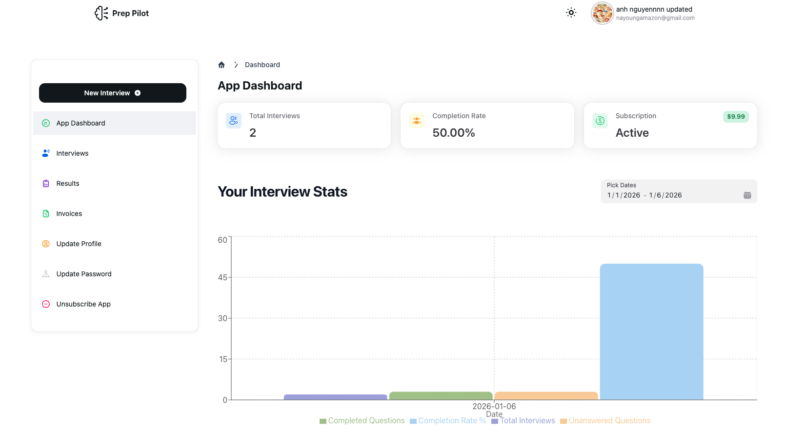
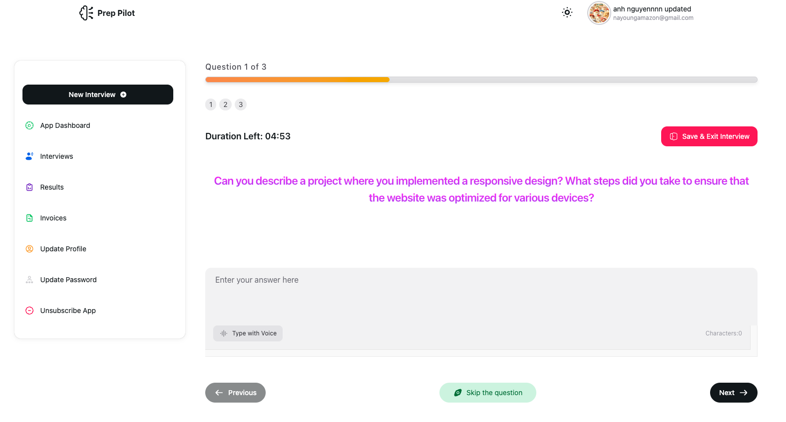
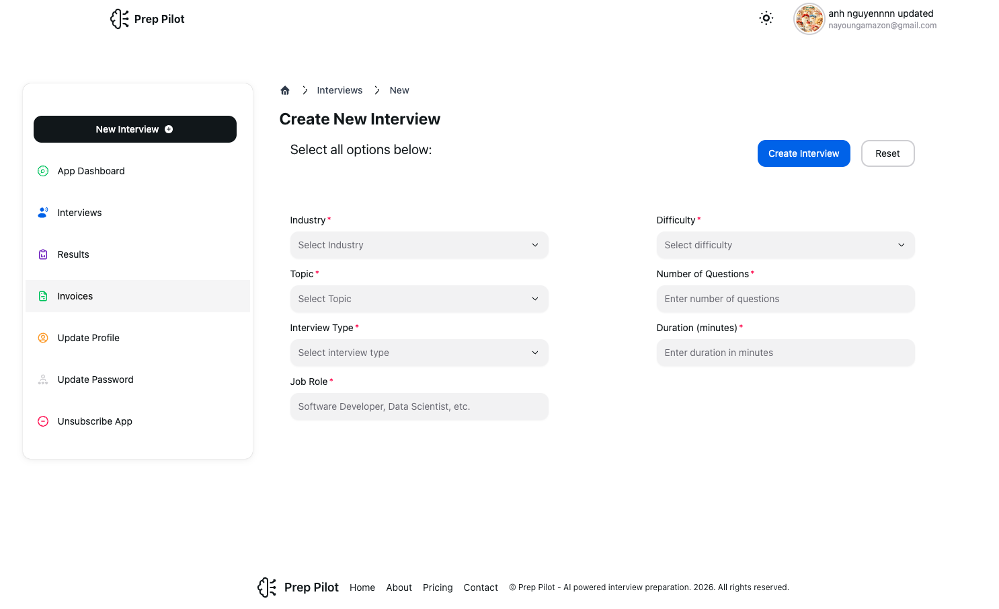
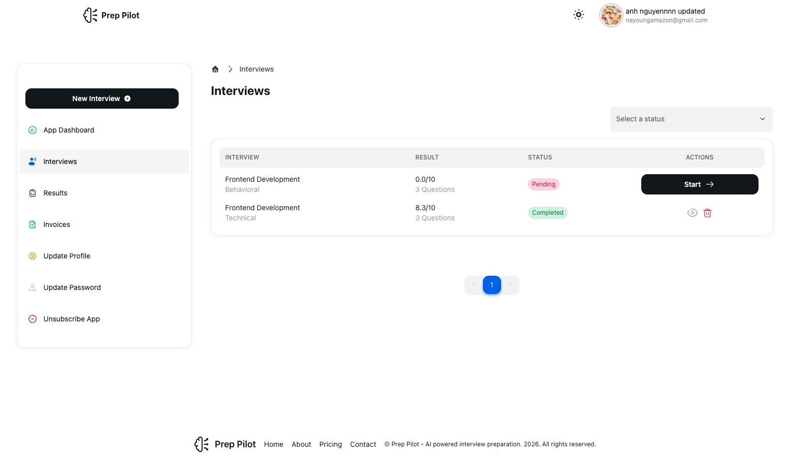
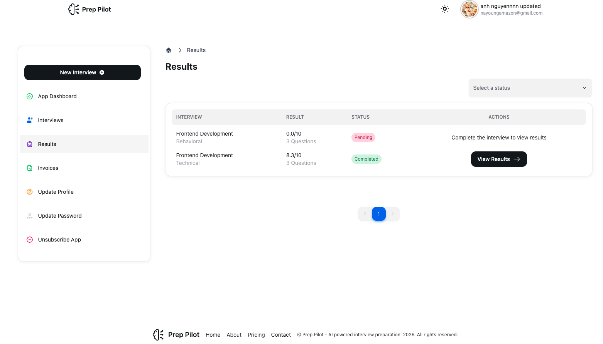
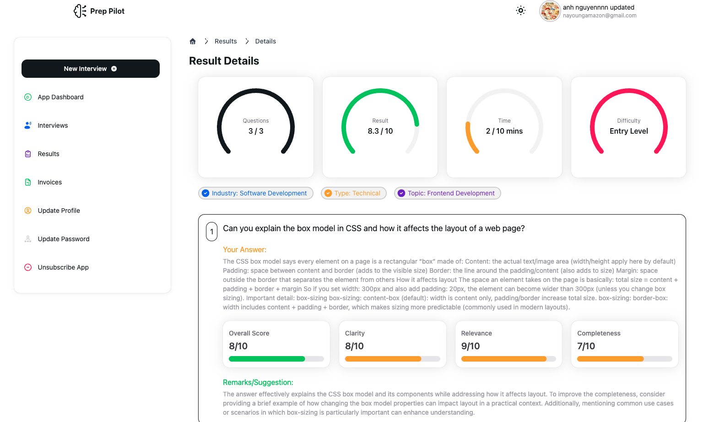
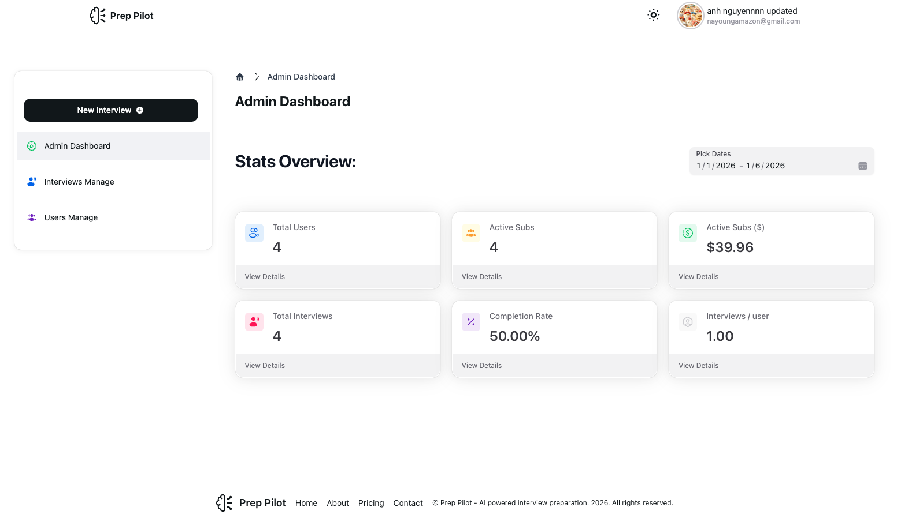
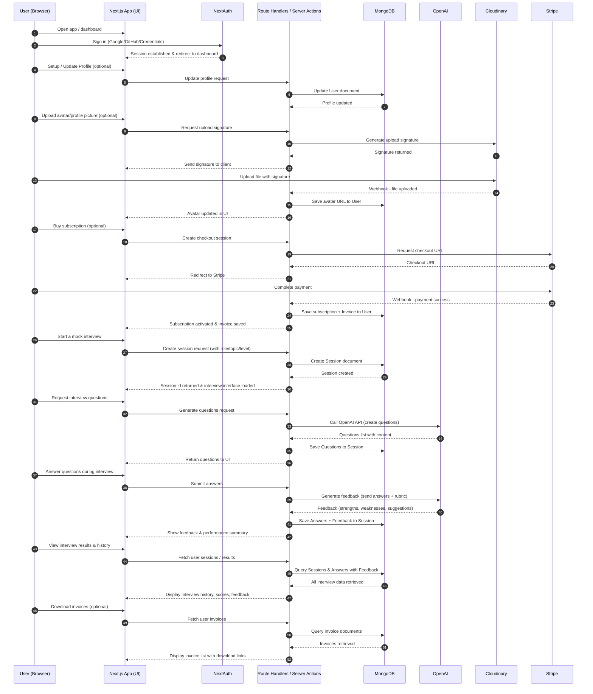

# PrepPilot — Interview Preparation AI


-000?logo=auth0&logoColor=white>)


An interview preparation web app that helps users practice with AI-generated questions, receive structured feedback, and track progress over time.

---

## Table of Contents

- [Demo](#demo)
- [Screenshots](#screenshots)
- [Tech Stack](#tech-stack)
- [Features](#features)
- [Getting Started](#getting-started)
- [Environment Variables](#environment-variables)
- [Project Structure](#project-structure)
- [How It Works](#how-it-works)
- [Authentication](#authentication)
- [AI & Prompting](#ai--prompting)
- [Media Uploads (Cloudinary)](#media-uploads-cloudinary)
- [Unit Testing Guide](#unit-testing-guide)
- [Deployment](#deployment)
- [Future Improvements](#future-improvements)
- [Contributing](#contributing)
- [License](#license)

---

## Demo

- Live Demo: https://prep-pilot-kohl.vercel.app/
- Video Demo: https://youtu.be/GLINyhjFjl4

Demo Video

https://github.com/user-attachments/assets/9f5cfd17-0457-4986-bb2b-757d508359df

[↑ Back to Top](#top)

---

## Screenshots

|                  **User Dashboard**                  |                  **Mock Interview**                  |
| :--------------------------------------------------: | :--------------------------------------------------: |
|  |  |

|               **Create Interview**                |                    **Invoice List**                     |
| :-----------------------------------------------: | :-----------------------------------------------------: |
|  |  |

|                  **Interview List**                  |                    **Result List**                     |
| :--------------------------------------------------: | :----------------------------------------------------: |
|  |  |

|                    **AI Feedback**                    |              **Admin Dashboard**               |
| :---------------------------------------------------: | :--------------------------------------------: |
|  |  |

[↑ Back to Top](#top)

---

## Tech Stack

- **Framework**: Next.js (TypeScript) + React
- **UI**: Tailwind CSS + HeroUI + Iconify
- **Auth**: NextAuth (Auth.js)
- **Database**: MongoDB
- **AI**: OpenAI API (server-side)
- **Media Storage**: Cloudinary
- **Payments**: Stripe (subscriptions, invoices, webhooks)
- **Unit Testing**: Vitest
- **Deployment**: Vercel

[↑ Back to Top](#top)

---

## Features

- **AI Interview Practice**: generate questions by role/seniority/topic
- **Mock Interview Sessions**: session-based practice + history
- **Structured Feedback**: strengths, weaknesses, improvements, sample answer hints
- **User Profiles**: update username, update profile picture
- **Subscription Gating + Invoices**: Stripe - buy subscription to use AI interview question generation and download invoice
- **Secure Authentication**: NextAuth (email/OAuth provider)
- **Image Uploads**: Cloudinary integration for avatars (or attachments)

[↑ Back to Top](#top)

---

## Getting Started

### Prerequisites

- Node.js **18+**
- npm / pnpm / yarn
- MongoDB (Atlas recommended)
- Cloudinary account
- OpenAI API key

### Installation

```bash
git clone https://github.com/anhng1106/prep-pilot.git
cd prep-pilot
npm install
npm run dev

Open http://localhost:3000
```

[↑ Back to Top](#top)

---

## Environment Variables

<details>
<summary>Click to expand the environment variables</summary>

Create a `.env.local` file in the project root.
**Do not commit** `.env.local` to GitHub.

### 1) Required Variables

| Variable                             | Example                                | Description                                                                                                                |
| ------------------------------------ | -------------------------------------- | -------------------------------------------------------------------------------------------------------------------------- |
| `MONGODB_URI_LOCAL`                  | `mongodb://localhost:27017/prep-pilot` | MongoDB connection string (Atlas recommended).                                                                             |
| `MONGODB_URI`                        | `mongodb://localhost:27017/prep-pilot` | MongoDB connection string (Atlas recommended).                                                                             |
| `API_URI`                            | `http://localhost:3000`                | Local host API URL                                                                                                         |
| `NEXTAUTH_URL`                       | `http://localhost:3000`                | Base URL used by NextAuth callbacks. Use your Vercel domain in production.                                                 |
| `NEXTAUTH_SECRET`                    | `your-long-random-secret`              | Secret for signing/encrypting NextAuth cookies/JWT.                                                                        |
| `OPENAI_API_KEY`                     | `sk-...`                               | OpenAI API key (server-side only).                                                                                         |
| `CLOUDINARY_CLOUD_NAME`              | `your_cloud_name`                      | Cloudinary cloud name.                                                                                                     |
| `CLOUDINARY_API_KEY`                 | `1234567890`                           | Cloudinary API key (server-side).                                                                                          |
| `CLOUDINARY_API_SECRET`              | `your_api_secret`                      | Cloudinary API secret (server-side).                                                                                       |
| `NEXT_PUBLIC_STRIPE_PUBLISHABLE_KEY` | `your_api_secret`                      | Stripe publisable key with prefix                                                                                          |
| `STRIPE_SECRET_KEY`                  | `your_api_secret`                      | Stripe secret key                                                                                                          |
| `STRIPE_WEBHOOK_SECRET`              | `your_api_secret`                      | Stripe webhook secret key verify that incoming webhook events are genuinely sent by Stripe and haven’t been tampered with. |

---

### 2) Optional Variables (Auth Providers)

> Only add these if you enabled the provider in your NextAuth config.

| Variable               | Example                         | Description                 |
| ---------------------- | ------------------------------- | --------------------------- |
| `GOOGLE_CLIENT_ID`     | `...apps.googleusercontent.com` | Google OAuth client ID.     |
| `GOOGLE_CLIENT_SECRET` | `...`                           | Google OAuth client secret. |
| `GITHUB_CLIENT_ID`     | `...`                           | GitHub OAuth client ID.     |
| `GITHUB_CLIENT_SECRET` | `...`                           | GitHub OAuth client secret. |

---

### 3) Optional Variables (Cloudinary Upload Preset / Folder)

Use these if you configured unsigned uploads or want consistent organization.

| Variable                   | Example                | Description                                     |
| -------------------------- | ---------------------- | ----------------------------------------------- |
| `CLOUDINARY_UPLOAD_FOLDER` | `preppilot/avatars`    | Default folder for uploads.                     |
| `CLOUDINARY_UPLOAD_PRESET` | `unsigned_preset_name` | Upload preset name (if using unsigned uploads). |

</details>

[↑ Back to Top](#top)

---

## Project Structure

<details>
<summary>Click to view the project structure with diagram</summary>

This repository follows a feature-oriented Next.js structure with a clear separation between:

- **UI routes & pages** (`app/`)
- **Reusable UI components** (`components/`)
- **Backend logic / services** (`backend/`)
- **Shared configuration & constants** (`config/`, `constants/`)
- **Static assets** (`public/`)

### Folder Tree (high-level)

```txt
prep-pilot/
├─ __tests__/              # Unit & integration tests (Vitest)
├─ actions/                # Server actions (auth, interview, payment)
├─ app/                    # Next.js App Router (routes, layouts, API routes)
│  ├─ api/                 # API route handlers
│  ├─ admin/               # Admin dashboard routes
│  ├─ app/                 # Main application routes (dashboard, interviews, etc.)
│  ├─ auth/                # Auth-related routes (login, register, password reset)
│  ├─ subscribe/           # Subscription page
│  ├─ globals.css          # Global styles
│  ├─ layout.tsx           # Root layout
│  ├─ page.tsx             # Home page
│  ├─ not-found.tsx        # 404 page
│  └─ providers.tsx        # App providers (Auth, Redux, etc.)
├─ assets/                 # Static assets (images, guides, docs)
├─ backend/                # Server-side logic (DB, OpenAI, utilities)
│  ├─ config/              # Database configuration
│  ├─ controllers/         # Request handlers (auth, interview, payment)
│  ├─ middleware/          # Express-like middleware
│  ├─ models/              # MongoDB schemas
│  ├─ openai/              # OpenAI integration
│  ├─ types/               # TypeScript types
│  └─ utils/               # Helper utilities
├─ components/             # Reusable UI components
│  ├─ admin/               # Admin components
│  ├─ auth/                # Auth components (login, register, etc.)
│  ├─ dashboard/           # Dashboard components
│  ├─ interview/           # Interview-related components
│  ├─ invoices/            # Invoice components
│  ├─ layout/              # Layout components (header, footer, breadcrumb)
│  ├─ payment/             # Payment components
│  ├─ result/              # Result components
│  ├─ date-picker/         # Date picker components
│  ├─ form/                # Form utilities
│  └─ Home.tsx             # Home page component
├─ config/                 # App configuration
│  ├─ Logo.tsx             # Logo component
│  └─ site.ts              # Site configuration
├─ constants/              # App constants
│  ├─ constants.ts         # General constants
│  ├─ data.ts              # Static data
│  └─ pages.ts             # Page constants
├─ helpers/                # Helper utilities
│  ├─ auth.ts              # Auth helpers
│  ├─ helper.ts            # General helpers
│  ├─ interview.ts         # Interview helpers
│  └─ pageTitles.ts        # Page title helpers
├─ hooks/                  # Custom React hooks
│  └─ usePageTitle.tsx     # Page title hook
├─ public/                 # Static assets (images, fonts)
├─ scripts/                # Utility scripts
├─ types/                  # Shared TypeScript types
│  └─ next.d.ts            # Next.js type definitions
├─ eslint.config.mjs       # ESLint configuration
├─ hero.ts                 # HeroUI configuration
├─ next.config.ts          # Next.js configuration
├─ tailwind.config.ts      # Tailwind CSS configuration
├─ postcss.config.mjs      # PostCSS configuration
├─ tsconfig.json           # TypeScript configuration
├─ vitest.config.ts        # Vitest configuration
├─ vitest.setup.ts         # Vitest setup
├─ package.json            # Dependencies & scripts
├─ proxy.ts                # Proxy configuration
├─ setup-tests.sh          # Test setup script
└─ README.md               # This file
```

Note: the **app/** folder is the “routing layer” (pages, layouts, API routes).
The **backend/** folder is the “service layer” (OpenAI, MongoDB, Cloudinary logic, etc.).

### Project Diagram (Mermaid)

```mermaid
flowchart TB
  Repo[Prep Pilot Repo]

  Repo --> Tests["__tests__"]
  Repo --> Actions["actions/"]
  Repo --> App["app/"]
  Repo --> Assets["assets/"]
  Repo --> Backend["backend/"]
  Repo --> Components["components/"]
  Repo --> Config["config/"]
  Repo --> Constants["constants/"]
  Repo --> Helpers["helpers/"]
  Repo --> Hooks["hooks/"]
  Repo --> Public["public/"]
  Repo --> Scripts["scripts/"]
  Repo --> Types["types/"]

  Repo --> ConfigFiles["Config Files<br/>next.config.ts<br/>tailwind.config.ts<br/>tsconfig.json<br/>..."]

  Tests --> TestFiles["auth.test.ts<br/>dashboard.test.tsx<br/>..."]

  Actions --> AuthAction["auth.action.ts"]
  Actions --> InterviewAction["interview.action.ts"]
  Actions --> PaymentAction["payment.action.ts"]

  App --> AppApi["api/"]
  App --> Admin["admin/"]
  App --> AppRoutes["app/ - main routes"]
  App --> Auth["auth/ - login, register"]
  App --> Subscribe["subscribe/"]
  App --> AppCore["layout.tsx, page.tsx"]

  AppApi --> AdminApi["admin/"]
  AppApi --> AuthApi["auth/"]
  AppApi --> DashboardApi["dashboard/"]
  AppApi --> InterviewApi["interviews/"]
  AppApi --> PaymentApi["payment/"]

  Backend --> DbCfg["config/ - DB Connect"]
  Backend --> Controllers["controllers/ - auth, interview, payment"]
  Backend --> Middleware["middleware/"]
  Backend --> Models["models/ - User, Interview"]
  Backend --> OpenAI["openai/ - OpenAI integration"]
  Backend --> BackendTypes["types/"]
  Backend --> Utils["utils/ - auth, email, stripe, cloudinary"]

  Components --> CompAuth["auth/ - Login, Register, etc."]
  Components --> Dashboard["dashboard/"]
  Components --> Interview["interview/"]
  Components --> Invoices["invoices/"]
  Components --> Layout["layout/ - Header, Footer, Breadcrumb"]
  Components --> Payment["payment/"]
  Components --> Result["result/"]

  Helpers --> AuthHelper["auth.ts"]
  Helpers --> InterviewHelper["interview.ts"]
  Helpers --> GeneralHelper["helper.ts, pageTitles.ts"]

  Hooks --> PageTitleHook["usePageTitle.tsx"]

  Constants --> GeneralConst["constants.ts"]
  Constants --> DataConst["data.ts"]
  Constants --> PagesConst["pages.ts"]

  Types --> NextTypes["next.d.ts"]
```



</details>

[↑ Back to Top](#top)

---

## How It Works

<details>
<summary>Click to view the project workflow and understand the end-to-end process. </summary>

Prep Pilot is a Next.js interview practice app using NextAuth (Google/GitHub/Credentials), MongoDB, OpenAI, and Cloudinary.

### 1) Sign in (NextAuth)

- User signs in using **Google / GitHub / Credentials**
- NextAuth creates a session and the app can access the user on protected pages

### 2) Start a Mock Interview (Create Session)

- User selects industry/role/topic/level
- Server creates a **Session** in **MongoDB**
- Session id is returned to the client to continue the interview flow

### 3) Generate Questions (OpenAI)

- Client requests questions for the current session (role/topic/level)
- Server calls **OpenAI** (server-side only)
- Generated questions are returned to the UI and saved to **MongoDB** for history/review

### 4) Submit Answers → Get Feedback (OpenAI)

- User submits answers
- Server sends answers + rubric/prompt to **OpenAI**
- OpenAI returns structured feedback (strengths, weaknesses, suggestions)
- Answers + feedback are saved to **MongoDB** and shown on the UI

### 5) Upload Media (Cloudinary)

- For avatars or attachments, the app uploads files to **Cloudinary**
- Cloudinary returns an asset URL
- The app stores the URL in **MongoDB** and displays it in the UI

### 6) Payment & Subscription (Stripe)

- User initiates subscription purchase on the subscribe page
- Client sends payment request to **Stripe**
- Stripe processes the payment and returns a checkout session
- Upon success, user subscription is recorded in **MongoDB**
- User can download invoices from their dashboard
- Webhook handlers verify payment events from **Stripe**

### 7) View Results & History

- Users can access their dashboard to view past interview sessions
- Each session displays questions answered, feedback received, and scores
- Interview history is retrieved from **MongoDB** and displayed in the UI

### Admin Features

- **Admin Dashboard**: view user statistics, manage users, view all interviews
- **User Management**: track subscriptions, view user activity
- All admin operations are protected and logged in **MongoDB**

### Data Stored (Conceptual)

- **User**: auth provider ids, profile info, avatar URL, subscription status, subscription start date
- **Session**: userId, role/topic/level, timestamps, summary/score (optional)
- **Question**: sessionId, content, tags/difficulty (optional)
- **Answer**: questionId, user response, timestamps
- **Feedback**: answerId, rubric scores, suggestions
- **Asset**: userId/sessionId, cloudinary URL, type (optional)
- **Invoice**: userId, subscription id, amount, status, download URL

### High-level Flow



</details>

[↑ Back to Top](#top)

---

## Authentication

<details>
<summary>Click to view the authentication flow — from sign in to secured access.</summary>

Prep Pilot uses **NextAuth (Auth.js)** to support multiple sign-in methods:

- **Google OAuth** - Sign in with Google account
- **GitHub OAuth** - Sign in with GitHub account
- **Credentials** (email + password) - Register and sign in with email/password

### How authentication works

1. **Sign In**: User signs in via Google/GitHub or registers with credentials.
2. **Session Creation**: NextAuth creates a secure JWT-based session stored in a cookie.
3. **Database Sync**:
   - For credentials: User password is verified via bcrypt
   - For OAuth: User is created in MongoDB if new, or linked to existing account
4. **Protected Access**: API routes and server components verify the session before returning data.
5. **Subscription Tracking**: User subscription status is included in the session token for quick access.

### Auth routes

- **NextAuth handler**: `app/api/auth/[...nextauth]/route.ts`
- **Custom login page**: `app/login/page.tsx`
- **Register page**: `app/register/page.tsx`
- **Password reset**: `app/password/forgot/page.tsx` and `app/password/reset/page.tsx`

### OAuth Integration

When users sign in with Google/GitHub:

- NextAuth checks if user exists in MongoDB by email
- If **new user**: Creates a new user document with OAuth provider info
- If **existing user**: Links the OAuth provider to their account (supports multiple auth methods)
- Profile picture is fetched from OAuth provider and stored if user doesn't have one

### Protected pages and API routes

Authentication is checked at multiple layers:

- **API routes**: Controllers validate session tokens passed via `Cookie` header
- **Server components**: Use `getAuthHeader()` helper to pass session tokens to API calls
- **Client side**: Components use `useSession()` hook to check authentication status and redirect to login if needed
- **Admin routes**: Additional role checks via `isUserAdmin()` helper to verify user has `admin` role
- **Subscription routes**: Checks via `isUserSubscribed()` helper for subscription-gated features

### Required environment variables

```bash
NEXTAUTH_URL=http://localhost:3000
NEXTAUTH_SECRET=your_long_random_secret

GOOGLE_CLIENT_ID=...
GOOGLE_CLIENT_SECRET=...

GITHUB_CLIENT_ID=...
GITHUB_CLIENT_SECRET=...
```

### Session data structure

The session token includes:

- User ID, name, email
- Profile picture URL
- Auth provider(s) linked to account
- Subscription status (active/past-due/inactive)
- User roles (for admin access)

</details>

[↑ Back to Top](#top)

---

## AI & Prompting

<details>
<summary>Click to expand and see how AI is used to generate mock interviews and analyze your answers.</summary>

Prep Pilot uses the OpenAI API to power two core experiences:

1. **Custom mock interview generation** (personalized question sets)
2. **Answer evaluation** (scores + actionable feedback)

### 1) Custom Mock Interview Generation

Users can build a mock interview by selecting:

- **Industry** (e.g., tech, finance, healthcare)
- **Topic** (e.g., JavaScript, data analysis)
- **Type** (technical / behavioral)
- **Job Role** (e.g., software engineer, project manager)
- **Experience Level** (entry / mid / senior)
- **Duration** (15–60 minutes)
- **Number of Questions**

The server converts these inputs into a prompt and requests a structured list of interview questions that match the selected scenario. The generated questions are saved to MongoDB so users can review them later.

### 2) AI Results Analysis (Scores + Feedback)

After the user submits answers, Prep Pilot sends the interview context + responses to OpenAI and generates:

- **Overall Score**
- **Clarity Score**
- **Relevance Score**
- **Correctness Score**
- **Personalized Feedback**
  - What the user did well
  - What needs improvement
  - Actionable suggestions for better answers

Results are stored in MongoDB and shown on the dashboard for tracking progress over time.

### Prompt Design Principles

- **Server-side only**: OpenAI requests run on the server to protect API keys.
- **Structured outputs**: prompts request predictable formatting (scores + feedback sections) so the UI can render reliably.
- **Context-aware**: prompts include industry/topic/type/role/level so questions and feedback stay relevant.

### Subscription Gating (Stripe)

AI features can be gated behind a **Stripe monthly subscription**:

- Free users can't access to interview generations and answers analyses.
- Subscribed users unlock full mock interview creation and detailed AI analysis.
- Billing and invoices are handled through Stripe and exposed in the user dashboard.

### Notes

- Keep prompt templates versioned so changes do not break the UI.
- Validate AI responses before saving/rendering (recommended: schema validation).
</details>

[↑ Back to Top](#top)

---

## Media Uploads (Cloudinary)

<details>
<summary>Click to view how Media Uploads (Cloudinary) setup</summary>

Prep Pilot uses **Cloudinary** to handle media uploads such as user avatars.

### Upload flow

1. User selects an image in the UI.
2. The app uploads the file to **Cloudinary** (server-side upload or client upload depending on implementation).
3. Cloudinary returns a secure URL.
4. The URL is saved in **MongoDB** and used to display the media in the app.

### Required environment variables

```bash
# Option A (recommended)
CLOUDINARY_URL=cloudinary://<api_key>:<api_secret>@<cloud_name>

# Option B (separated)
CLOUDINARY_CLOUD_NAME=
CLOUDINARY_API_KEY=
CLOUDINARY_API_SECRET=
```

</details>

[↑ Back to Top](#top)

---

## Unit Testing Guide

<details>
<summary>Click to view how to run unit test</summary>

### Setup Instructions

#### Install Testing Dependencies

```bash
npm install --save-dev vitest @testing-library/react @testing-library/jest-dom jsdom @vitejs/plugin-react
```

### Running Tests

#### Run All Tests

```bash
npm test
```

#### Run Specific Test File

```bash
npm test -- helpers.test.ts
```

#### Run Tests in Watch Mode

```bash
npm test -- --watch
```

#### Run Tests with UI Dashboard

```bash
npm run test:ui
```

#### Generate Coverage Report

```bash
npm run test:coverage
```

### Debugging Tests

#### Run Single Test

```bash
npm test -- --reporter=verbose helpers.test.ts
```

#### Debug Mode

```bash
node --inspect-brk ./node_modules/.bin/vitest
```

</details>

[↑ Back to Top](#top)

---

## Deployment (Vercel)

<details>
<summary>Click to view how Prep Pilot was deployed on Vercel.</summary>

Prep Pilot is deployed on **Vercel**.

### 1) Deploy to Vercel

1. Push the project to GitHub.
2. Go to Vercel → **New Project** → Import `prep-pilot`.
3. In **Project Settings → Environment Variables**, add all required variables:
   - `MONGODB_URI`
   - `NEXTAUTH_URL`
   - `NEXTAUTH_SECRET`
   - `GOOGLE_CLIENT_ID`, `GOOGLE_CLIENT_SECRET`
   - `GITHUB_CLIENT_ID`, `GITHUB_CLIENT_SECRET`
   - `OPENAI_API_KEY`
   - Cloudinary variables (`CLOUDINARY_URL` or `CLOUDINARY_CLOUD_NAME` + `CLOUDINARY_API_KEY` + `CLOUDINARY_API_SECRET`)
   - Stripe variables (if enabled): `STRIPE_SECRET_KEY`, `STRIPE_WEBHOOK_SECRET`, `NEXT_PUBLIC_STRIPE_PUBLISHABLE_KEY`, `STRIPE_PRICE_ID`

4. Click **Deploy**.

### 2) Configure OAuth Callback URLs (Google / GitHub)

#### Google OAuth

In Google Cloud Console → OAuth Client:

- **Authorized JavaScript origins**:
  - `http://localhost:3000`
  - `https://YOUR_VERCEL_DOMAIN`
- **Authorized redirect URIs**:
  - `http://localhost:3000/api/auth/callback/google`
  - `https://YOUR_VERCEL_DOMAIN/api/auth/callback/google`

#### GitHub OAuth

In GitHub Developer Settings → OAuth App:

- **Homepage URL**:
  - `https://YOUR_VERCEL_DOMAIN`
- **Authorization callback URL**:
  - `https://YOUR_VERCEL_DOMAIN/api/auth/callback/github`

### 3) Stripe Webhook (if subscriptions are enabled)

1. Create a webhook endpoint in Stripe pointing to your production webhook route (example):
   - `https://YOUR_VERCEL_DOMAIN/api/webhooks/stripe`
2. Subscribe to required events (commonly):
   - `checkout.session.completed`
   - `invoice.paid`
   - `customer.subscription.created`
   - `customer.subscription.updated`
   - `customer.subscription.deleted`
3. Copy the webhook signing secret into:
   - `STRIPE_WEBHOOK_SECRET`

### 4) Production Checklist

- `NEXTAUTH_URL` matches your Vercel domain.
- OAuth redirect URIs are correct for production.
- All secrets exist in Vercel (no missing env vars).
- MongoDB Atlas network access is configured to allow the deployment.
- Cloudinary and Stripe keys are set for the correct environment (test vs live).
</details>

[↑ Back to Top](#top)

---

## Future Improvements

<details>
  <summary>Click to explore planned futures coming.</summary>

- **Adaptive difficulty**: automatically adjust question difficulty based on user performance and history.
- **Stronger analytics**: topic-level insights (strengths/weaknesses), progress trends, and personalized learning plans.
- **Follow-up questions**: AI-generated follow-ups based on the user’s answer to simulate real interviews.
- **Export results**: download interview reports as PDF/Markdown for sharing or saving.
- **Better question bank**: tagging, search, filtering, and “recommended next questions”.
- **More subscription tiers**: multiple plans (free/plus/pro), add-ons, and usage-based limits with Stripe.
- **Team / classroom mode**: shared libraries of interviews, rubrics, and admin-managed cohorts.
- **Improved onboarding**: guided setup, role presets, and sample interviews for new users.
- **Security & reliability**: rate limiting for AI routes, improved error handling, and better logging/monitoring.
</details>

[↑ Back to Top](#top)

---

## Contributing

<details>
  <summary>Click to view contribution instruction if you have any new ideas.</summary>
Contributions are welcome and appreciated!

### How to Contribute

1. Fork this repository
2. Create a new branch:
   ```bash
   git checkout -b feature/your-feature
   ```
3. Install dependencies:
   ```bash
   npm install
   ```
4. Run the project locally:
   ```bash
   npm run dev
   ```
5. Make your changes and commit:
   ```bash
   git add .
   git commit -m "Add: your feature"
   ```
6. Push to your fork:

   ```bash
   git push origin feature/your-feature
   ```

7. Open a Pull Request

### Guidelines

- Keep code style consistent (TypeScript + ESLint).

- Prefer small, focused PRs (one feature/fix per PR).

- Update documentation when behavior changes.

- Do not commit secrets (use .env.local and .env.example).

- Ensure the app builds successfully before submitting a PR:
  ```bash
  npm run build
  ```

### Reporting Issues

If you find a bug or want to request a feature, please open an issue and include:

- Steps to reproduce
- Expected vs actual behavior
- Screenshots/logs (if available)
</details>

[↑ Back to Top](#top)

---

## License

This project is licensed under the **MIT License**.

See the [LICENSE](LICENSE) file for more details.
